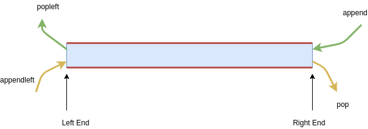

% Deep Dive into the Python Standard Library
% { width=200px }
% [github.com/grapheo12](github.com/grapheo12)

# The Collections Module


## What are collections?

High-performance containers or data structures.


## A zoo of data structures

- namedtuple

- deque

- ChainMap

- Counter

- OrderedDict

- defaultdict

- UserDict

- UserList

- UserString

## Let's look into some of them!

- deque

- defaultdict

- Counter

## Deque

Short for: "Double Ended QUEue"

Can provide both FIFO and LIFO operations.
Hence useful for a quick implementation of a stack and a queue.

$O(1)$ push/pop in both directions

## The main 4 methods



## Other interesting methods and properties

- ` rotate(n) ` : Rotates the deque by n places to the right.

- ` maxlen `: Initializing with maxlen specifies the size of the queue.

## Uses

1. In the BFS algorithm.

2. In making a simple/roundrobin dispatcher or scheduler.

3. ...and many more.


## Defaultdict

Handy extension of the regular dict.

Returns a pre-specified default value if a key is not found.

## Usage

A defaultdict is initialized with a callable.
The return value of the callable is returned when a key is not found.

```python

from collections import defaultdict

a = defaultdict(int)    #Default value is 0
b = defaultdict(list)   #Default value is an empty list
c = defaultdict(lambda: "abc")
#Default value is the return value of the lambda function
#Which is "abc" here.

```

## Bonus: A practice problem

A classic question to use a defaultdict on:

[Leetcode: Group the people given the group size they belong to](https://leetcode.com/problems/group-the-people-given-the-group-size-they-belong-to/)


## Counter

As the name suggests, it is used to count.
Stores the counts in (key, value) pairs like a dict.

Very useful for frequency analysis.

Similar to defaultdict, absent keys evaluate to 0 here (corresponding to 0 entries)

It is similar to multisets in C++ STL.

## Initialization

Direct keyword arguments:

```python

>>> c = Counter(a=2, b=1, c=3)

```

From a list or iterable (even a dict with frequencies):

```python

>>> c1 = Counter([1, 2, 1, 1, 3, 2])
>>> c2 = Counter("pythonIsAwesome")
>>> c3 = Counter({1: 5, "a": 2})

```

Blank initialization:

```python

>>> c = Counter()

```

## Interesting methods

The most common method of the counters is the `most_common([n])`! (Pun intended)
Returns $n$ most common entries in the counter. If `n` is not given, all entries are returned in sorted order.

`elements()` returns the elements of the counter in the order of entry of the 1st occurrence of each key.

`update` method expects an iterable (even another Counter) and adds the frequencies of that iterable into itself.

Besides these, Counter also supports addition, subtraction, union and intersection operations.


