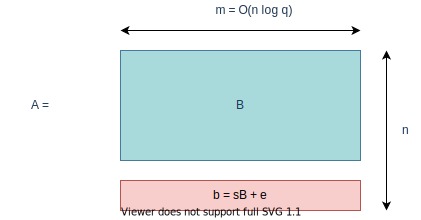

# Classical Use of Cryptography

## Problem of talking through insecure channel

## Message sent with encryption

## Semi-formally speaking

Each party has a **secret** key $K$ and and algorithm (or function) $f$, such that, give a message $m$,
we can generate a ciphertext $c = f(m, K)$ *easily*, but it is difficult to know $m$ or $K$, given just the ciphertext $c$.

Then, even through an insecure channel, we can transmit $c$. No eavesdropper will be able to decipher the underlying message.

## The CIA triad

Generally, in cryptography we try to ensure 3 security primitives:

- **C**onfidentiality: Adversary should not be able to learn our secret message
- **I**ntegrity: They also should not be able to tamper our message
- **A**vailability: Our message should be readily accessible to the recipient without any downtime.

</section><section>

But now we want to do many things more with crypto......

# Encrypted computation

## Computation on the cloud

- In today's world, CPU-intensive workloads are carried out in high performance servers on the cloud.

- But the data on which they operate, often are very sensitive.
So ideally, we don't want to send these in clear to the server.

- Solution is to encrypt the data and then send.

- **But** our computation algorithms do not operate on encrypted data.

- So we need to come up with schemes and modify our algorithms to support computation on encrypted data.

## Problem with common ciphers

- Encryption generally breaks the ordering and any kind of semantic meaning of the plaintext.

- This is not a problem generally, rather it's an expected feature! However, it's problematic for us.

- For example, suppose $a$ and $b$ are integers and $E$ is an encryption function. Then, generally speaking,

$E(a) + E(b) \neq E(a + b)$

## Homomorphic Encryption

- The challenge is to contruct ciphers which support computation of arbitrary functions (maybe from a given Function Space).

$E(f(a)) = \hat{f}(E(a))$

- Such ciphers are said to perform Homomorphic Encryption.

- One of the earliest proponents of this idea is **Craig Gentry** from IBM.

## Food for thought

Can any type of function be computed over encrypted data?

What must be the minimum complexity?

</section><section>

- You cannot do Binary Search or similar $O(lg n)$ algorithms.

- If you are able to do so, it means you have some partial information about the plaintext.

- For any good cipher, you don't have this information.

- So any allowed algorithm must be more complex than $O(lg n)$.

- Generally, the computation algorithms are expressed as **circuits**.

## Classification

There are 3 main types of Homomorphic Encryption:

- **Partially** Homomorphic: Supports very limited operations (may / may not be unbounded number of times)

- **Somewhat** Homomorphic: Supports limited operations that can be performed only a set number of times

- **Fully** Homomorphic: supports any operation any number of times.

## Bootstrapping

- FHE schemes introduce noise.

- If we compute too many operations, the noise becomes so high that the decryption becomes impossible.

- To mitigate that, a bootstrapping procedure is used.

## Gentry's Bootstrapping

- Convert the decryption function into a circuit.

- Encrypt the private key (with some other key).

- Homomorphically compute the decryption function with the encrypted secret key and current (noisy) ciphertext.

- What you get back is another ciphertext but the noise is gone.

# Examples of HE schemes

## Simple example: RSA

- Remember that, $E(x) = x^e (mod n)$

- So, $E(x) \cdot E(y) = x^e \cdot y^e = (xy)^e = E(xy) (mod n)$

Which means, RSA supports the homomorphic multiplication.

## Problems with RSA

- It is not fully homomorphic. You can't really do the addition.
- RSA is not **semantically secure**.
- RSA depends on the fact that factoring a number is hard.
But it is not true for quantum computers.

Hence, we shall look into some post-quantum constructions.

## GSW Scheme

- Gentry-Sahai-Waters is a fully Homomorphic Construction.

- There are generally 2 types of FHE schemes currently.
One type is based on GSW, the other one on BFV.

- GSW depends on problem known as **Learning with Errors (LWE)**.

## Learning with Errors

Given integers $q, n$ and a vector $\mathbf{s} \in \mathbb{Z}_q^n$,
we construct samples using the following process:

- Select a random vector $\mathbf{a} \in \mathbb{Z}_q^n$ and a *small* Gaussian noise $e \in (0, 1)$
- Calculate $t = (\mathbf{a} \cdot \mathbf{s}) / q + e$
- Output $(\mathbf{a}, t)$

</section><section>

Given many such samples, the problem is to find $\mathbf{s}$.

Or in the decision version of the problem,
the goal is to distinguish between randomly generated tuples $(\mathbf{a}, t)$ and that generated by the above process.

Regev showed that both can be reduced from each other.

Both of these problems are hard.

## GSW Details

- The secret key is $\mathbf{t} = [\mathbf{-s}, 1] \in \mathbb{Z}_q^n$
- The public key $A \in \mathbb{Z}_q^{n \times m}$ is constructed as follows:

- $B$ is publicly known matrix and $e$ is a vector of small Gaussian errors.

</section><section>

- Note that, $tA = -sB + sB + e = e \approx 0$

- Our message space is $\lbrace 0, 1 \rbrace$

- In addition to these we also have public gadget matrix $G$ and a corresponding function $G^{-1}(.)$ such that,
$G G^{-1} (M) = M$ for any $M \in \mathbb{Z}^{n \times m'}$.

## Encryption

- Choose a random $R \in \mathbb{Z}_q^{m \times m}$.

- This is done for key blinding purpose.

- Compute the ciphertext as $C = AR + xG$ where $x$ is the message bit.

Note that $tC = eR + xtG \approx xtG$

## Decryption

- Construct $w \in \mathbb{Z}_q^{1 \times n}$ as $w = [0, 0, ..., \lceil q/2 \rceil]$

- Compute $v = tCG^{-1}(w^T)$

Note that $v \approx xtGG^{-1}(w^T) = xtw^T = x \lceil q/2 \rceil$

If $v < \lceil q/2 \rceil$, $x = 0$, otherwise $x = 0$

## Homomorphic Addition (XOR)

- Let 2 bits be $x_1$ and $x_2$ and their encryptions be $C_1$ and $C_2$.

- Define $C^+ = C_1 + C_2$

- Clearly, $C^+ = A(R_1 + R_2) + (x_1 + x_2)G \implies tC^+ \approx (x_1 + x_2)tG$

## Homomorphic Multiplication (AND)

- Define $C^{\times} = C_1 G^{-1}(C_2) = (AR + x_1G) G^{-1}(C_2)$

- Clearly, $tC^{\times} = t C_1 G^{-1}(C_2)$

$\approx x_1 t G G^{-1}(C_2) = x_1 t C_2 \approx x_1 x_2 t G$

## Problems

- **Ciphertext expansion**: Even for a single bit, the ciphertext is huge.

- **Error propagation**: For addition error propagates linearly. But for multiplication, it is exponential.

## References

1. [Regev's paper on LWE](https://cims.nyu.edu/~regev/papers/lwesurvey.pdf)
2. [GSW paper](https://eprint.iacr.org/2013/340.pdf)
3. [Mathematics of Lattices by Vindod Vaikuntanathan](https://www.youtube.com/watch?v=LlPXfy6bKIY&feature=youtu.be&ab_channel=SimonsInstitute)
4. [Craig Gentry's PhD Thesis](https://crypto.stanford.edu/craig/craig-thesis.pdf)
 Some recent works:
5. [FHEW paper](https://eprint.iacr.org/2014/816.pdf)
6. [TFHE paper](https://eprint.iacr.org/2018/421.pdf)
7. [Multiparty Computation in FHE](https://eprint.iacr.org/2015/345.pdf)

## Thank You