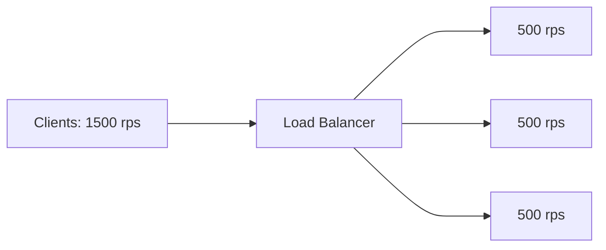
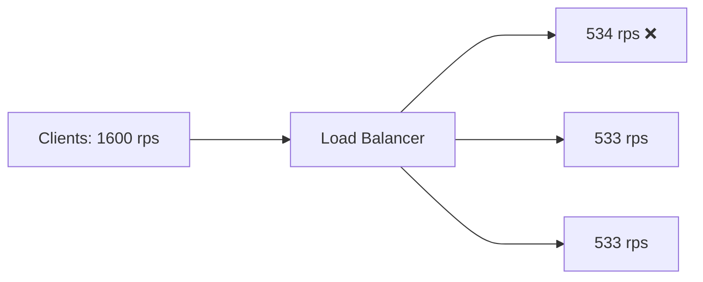
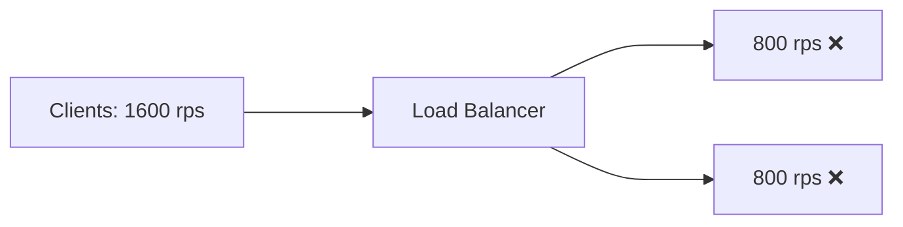

---
# You can also start simply with 'default'
theme: seriph
# random image from a curated Unsplash collection by Anthony
# like them? see https://unsplash.com/collections/94734566/slidev
background: /assets/background.png
# some information about your slides (markdown enabled)
title: Metastable Failures
info: |
  Talk for Group Meeting
# apply unocss classes to the current slide
class: text-center
# https://sli.dev/features/drawing
drawings:
  persist: false
# slide transition: https://sli.dev/guide/animations.html#slide-transitions
transition: slide-left
# enable MDC Syntax: https://sli.dev/features/mdc
mdc: true
---

# Metastable Failures

A Beginner's Guide

Disclaimer: Completely new area for me.

---
transition: fade-out
---

# What are Metastable Failures?

> Metastable failures occur in open systems with an uncontrolled source of load where a trigger causes the system to enter <b>a bad state that persists even when the trigger is removed</b>.
>
> In this state the goodput (i.e., throughput of useful work) is unusably low, and there is a sustaining effect—often involving work amplification or decreased overall efficiency that prevents the system from leaving the bad state.

 

## Sources

1. *"Metastable Failures in Distributed Systems"* - Bronson et al, HotOS '21
2. *"Metastable Failures in the Wild"* - Huang et al, OSDI '22

<!-- 
But first, a story
-->

---
transition: slide-up
level: 2
---

<v-click>

- Little Ronnie joins a secret team of devs to manage the infrastructure of a country-wide exam.
</v-click>

<v-click>

- Ronnie learns Kubernetes on the job.

</v-click>
<v-click>

- He deploys a critical CPU-intensive service, **but forgets to load test it before opening it to the public.**
</v-click>
<v-click>

- The service broke within a minute of opening, and wouldn't recover even when the load went down.
</v-click>
<v-click>

- Ronnie spent 24 hours hot-fixing everything amidst a twitter-storm.

</v-click>

   

# Little Ronnie is me!

And the guy before me, apparently

--- #4
transition: fade-out
---

# What happened?

--- #5
transition: fade-out
---

# What happened?

--- #6
transition: fade-out
---

# What happened?

--- #7
transition: fade-out
---

# What happened?

--- #8
transition: fade-out
---

# What happened?

Pods would come up and go down in oscillating fashion.

Only solution: Take system offline. Reboot everything.

Take everything back online at once.

--- #9
transition: slide-left
---

