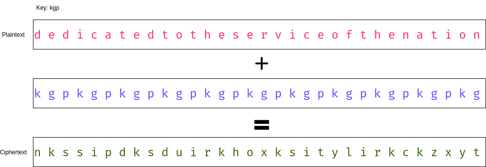

# Cryptography primer

## Problem of talking through insecure channel

## Message sent with encryption

## Semi-formally speaking

Each party has a **secret** key $K$ and and algorithm (or function) $f$, such that, give a message $m$,
we can generate a ciphertext $c = f(m, K)$ *easily*, but it is difficult to know $m$ or $K$, given just the ciphertext $c$.

Then, even through an insecure channel, we can transmit $c$. No eavesdropper will be able to decipher the underlying message.

## Some caveats...

- How do I transmit the key to each party safely?
- The encryption algorithm $f$ must be kept public (Kerkchoff's principle). Keeping it secret doesn't provide any extra security.

## But most importantly....

How do I guarantee that my function $f$ does not leak information about $m$ and $k$?

# Cryptanalysis

## Branches of the field

**Cryptography**: How do I make these cryptographic algorithms?

**Cryptanalysis**: How do I break these cryptographic algorithms?

**Cryptology** = Cryptography + Cryptanalysis

## Types of attack models

- Ciphertext only
- Known plaintext
- Chosen ciphertext
- Chosen plaintext

## Ciphertext only

Attacker possesses a string of ciphertext

## Known plaintext

Attacker possesses a string of plaintext and the corresponding ciphertext.

## Chosen plaintext

Attacker can choose plaintext and obtain the corresponding ciphertexts.

## Chosen ciphertext

- The attacker has access to the decryption oracle (a blackbox that does the decryption).
- The attacker can choose ciphertext and use the oracle to get the corresponding plaintexts

## Order of Powers of Attackers

Chosen ciphertext > Chosen plaintext > Known plaintext > Ciphertext only

# Shift Ciphers

## Some notations and conventions

- Our plaintext and ciphertext will come from lowercase English aplhabets only (no numbers or spaces).
- Each letter in `[a-z]` can be mapped to `[0-25]`. We will use them interchangeably.
- All additions are modulo 26. We are working in $\mathbb{Z}_{26}$.

## The Cipher

- **Encryption**: $E_K (m) = (m + K) mod 26$
- **Decryption**: $D_K (c) = (c - K) mod 26$

For example, if my key is `'c'` or `2`, the string `hellocryptography` encrypts to `jgnnqetarvqitcrja`.

## Brute-force

- One way to break the cipher will be to try out every possible key.
There are 26 in total. So it is doable.

- However, it depends on whether you can get the meaning of the underlying message when you are decrypting.
And this technique doesn't scale that well with the size of the alphabet.

## Statistical approach

- Notice that, if for any single letter, we can find out what it maps to in the ciphertext, then we are done.
- Also, the letter-frequency in the plaintext and the ciphertext will follow the same pattern. But the labels will be different.

## Letter frequencies in English language

- E occurs with highest probability: 0.12
- T, A, O, I, N, S, H, R occur with 0.06 - 0.09 probability
- D, L with 0.04
- C, M, U, W, F, G, Y, P, B with 0.015 - 0.028
- V, K, J, X, Q, Z with &lt; 0.01

Similar distribution exists for bigrams and trigrams as well.

</section><section> 
  

## The statistical attack

Assuming the underlying message is written in common English:

- Find out the frequency distribution of the ciphertext at hand.
- The most occurring letter is likely to be the encryption of 'e'.
- Use that information to find out the key.
- You can cross-check with the mappings with other less frequent letters as well.

# Vigenere cipher

## Polyalphabetic cipher

- One weakness of the shift cipher class was that a particular letter of the alphabet always mapped to a single letter.
Such ciphers with one-to-one mappings are called **Monoalphabetic cipher**.

- A notch higher in security are the **polyalphabetic ciphers**. We are going to discuss one of them.

## Encryption scheme

- The key, instead of being a single letter (or number), is a word (a tuple of numbers) in this case.

- We take the plaintext and then repeat our keyword such that it becomes as long as our plaintext.
Then we simply add letters of the same index together to get the ciphertext.

## Example

</section><section>

- Notice how the 1st 'd' and the 2nd 'd' map to 2 different letters.
- Also, 'd' and 'i' map to same letter.

## Attacking Vigenere cipher

- Brute force is out of question. It will be of exponential complexity.
- Statistical attack that we used for Shift ciphers won't work due to many-to-many mapping.

In fact, for years, Vigenere was thought to be unbreakable!

## Kasiski Test

- This is a heuristic approach that gives some probable lengths of the key (let's call it $m$).

- Note that, same pieces of plaintext separated by a distance of a multiple of the key length, will map to the same ciphertext.

</section><section>

- Hence, we look for repeating patterns in the ciphertext and note down the distances between them (we'll call these $\delta_i$).

- We find the gcd of these distances. We have $m | \delta_i \implies m | gcd(\delta_i)$.

- How big a pattern you should use is entirely based on trial-and-error. Usually, the smaller the pattern size, the more chance of getting a false positive.

## Index of coincidence

- It is used to confirm the $m$ values output by Kasiski test.
- Index of coincidence $I_c$ of a string $x = x_1 x_2 x_3 ... x_n$ is defined as the probability that 2 random elements of $x$ are identical.
- Let's denote the frequency of each of the 26 letters by $f_i$. Then by total probability, we can say:
$I_c(x) = \frac{\sum_{i = 0}^{25} \binom{f_i}{2}}{\binom{n}{2}} \approx \sum p_i^2$

</section><section>

- For a piece of text written in English language, $I_c$ comes out to be around 0.065.

- For a random piece of text, assuming uniform distribution of letters, $I_c \approx$ 0.038.

- So there is a big jump!

</section><section>

- Let us denote the ciphertext as $y = y_1 y_2 ... y_n$.

- For any integer $m$, let us split the ciphertext into $m$ strings, by picking elements $m$ distance apart:

$Y_1 = y_1 y_{m + 1} y_{2m + 1} ...$

$Y_2 = y_2 y_{m + 2} y_{2m + 2} ...$

$...$

$Y_m = y_m y_{2m} y_{3m} ...$

</section><section>

- If indeed $m$ is the key length, then notice that each of $Y_i$ is an instance of **Shift cipher**.

- Hence there letter statistics is the same as that of English language.

- Hence, in that case, $I_c(Y_i) \approx 0.065$

- But if $m$ is not the key length, we will not see such statistics. In practice, the $I_c$ remains around $0.04$.

- Thus we can get a confirmation on the key lengths output by Kasiski test.

## Mutual Index of Coincidence

- Our next and final task is to find the key $K$.

- Using mutual index of coincidence, we will not be able to find the key exactly, but the relative difference between the letters of the key will be known.

- For example, we will get the information like the second character of the key is 5 letters ahead of the first and so on.

</section><section>

- Mutual Index of coincidence between 2 strings is defined as the probability that 2 random characters picked from each of the strings is same.

- Suppose the strings are $x = x_1 x_2 x_3 ... x_n$ and $y = y_1 y_2 ... y_n'$ and the corresponding letter frequencies are $f_i$ and $f'_i$ then:

$MI_c(x, y) = \frac{\sum_{i = 0}^{25} f_i f'_i}{n n'} = \sum p_i p'_i$

</section><section>

- If both $x$ and $y$ have the same distribution of letters, mutual index essentially becomes the index of coincidence (well, approximately!).

- So, if that is the case, then in case of English language-like strings, we will get the mutual index of coincidence as 0.065.

</section><section>

- Remember the $Y_i$'s we created in the Index of coincidence test.

- We will now calculate the $MI_c(1, j)$ for every $j \neq 1$.

- If $MI_c(1, j) \approx 0.065$, we can be sure that $Y_1$ and $Y_j$ come from the same distribution.

- Which can only happen if they have the same amount of shifts. That is, the key letters in position $1$ and $j$ are the same.

</section><section>

- If the $MI_c$ is significantly different, then possibly $Y_1$ and $Y_j$ are not having the same letter.

- To find the relative difference between them, we keep shifting $Y_1$ by $1, 2, ..., 25$.

- Let's say that for shift by $p$, $MI_c$ became close to $0.065$.

- This would mean that there is a high chance that the $j^{th}$ letter of the key is $p$ ahead of the $1^{st}$ letter.

## Revealing the key

- We will run this process for all $Y_j$, thereby calculating the relative differences among the letters of the key with respect to the $1^{st}$ letter.

- The only job now is to determine what the $1^{st}$ letter is.

- This can be easily brute-forced. We can try all 26 combinations.

## Demerits of this process

- This is a statistical attack. So there is not guarantee that the revealed key is 100% correct.

- It requires a substantial amount of ciphertext to become accurate.

## Demo time!!

# Parting words

## References

- "Cryptography: Theory and Practice" by Douglas R. Stinson

- Prof. Debdeep Mukhopadhyay's lecture on this topic in Cryptography and Network Security course (NPTEL)

## Further Readings:

- Shanon's theory of Entropy
- Unicity distance
- Diffie-Hellman Key Exchange

## Thank You!

This slide deck is available on my website:

Source code: [github.com/grapheo12/yt-slides/blob/master/vigenere.md](github.com/grapheo12/yt-slides/blob/master/vigenere.md)
